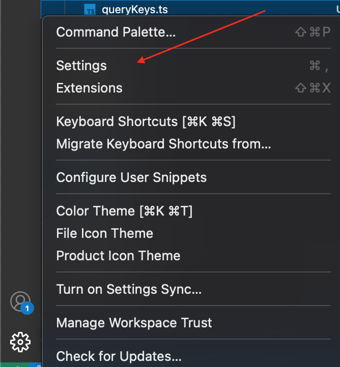

# Coding conventions

## Introduction <a href="#loom-header-1" id="loom-header-1"></a>

**The purpose of the coding convention is to share the minimum awareness of coding within the team and to improve the quality of the entire system.**

What is written here is not fixed, but rather we plan to update it more and more if there are good rules that should be unified.\
Basically, the policy is " **If the rules are bad, improve them** ", but it's bad manners to ignore the rules and implement whatever you want, so be careful.\
Another point of view for code reviews is whether they comply with these rules.

## Naming convention <a href="#loom-header-2" id="loom-header-2"></a>

| **item**                       | **Naming convention** | **example**      |
| ------------------------------ | --------------------- | ---------------- |
| css selector name              | kebab case            | main-content     |
| in the constants directory     | upper snake case      | INITIAL\_PAGING  |
| page routing                   | kebab case            | profile-edit     |
| folder's name                  | camel case            | profileEdit      |
| tsx file (not in page routing) | pascal case           | ProfileEdit.tsx  |
| ts file                        | camelcase             | updateProfile.ts |
| variable                       | camelcase             | user             |
| function                       | camelCase             | getUser()        |

### Use union types instead of enum types for enums <a href="#loom-header-19" id="loom-header-19"></a>

```
// enum
enum Permission {
  Read = 'r',
  Write = 'w',
  Execute = 'x'
}

// union
const PERMISSION = {
  READ: 'r',
  WRITE: 'w',
  EXECUTE: 'x'
} as const;
type Permission = typeof PERMISSION[keyof typeof PERMISSION]; // 'r' | 'w' | 'x'
```

The \* `typeof 〜〜`part defines the valueOf function in the actual code, so replace it with that

The meaning of a union type value by itself may be ambiguous.\
It is also possible to get and process the enumerated values ​​with Object.values ​​, so this way of writing is more convenient.

**where the enum is defined**

A union type definition can be in the same file if it is only used by a single class or component.\
However, for common types that are referenced from multiple locations, create a file in src/constants.

### Type <a href="#loom-header-21" id="loom-header-21"></a>

type can do more than interface, prefer using type to keep your code consistent

\=> Use only type for the whole project

Naming convention sample: type T\<typeName>

### About default export <a href="#loom-header-22" id="loom-header-22"></a>

Basically, it is a policy not to use default export.\
This is because there are problems such as the default export allows the importer to freely decide the name, and the IDE's code interpolation cannot be used.\
Reference: [Why the Qiita development team stopped using default export in React development - Qiita](https://qiita.com/ohakutsu/items/218939c93c8fc8620d77)

**When to use default export**

For store, default export is established as a format, so `default export`use it.\
**Components under the pages directory** need to support React.lazy, so `default export`use .

`default export`\* Due to the circumstances so far, there are things that use even normal components . Please feel free to correct this at any time.\
summary

| **directory**                   | **Using default exports** |
| ------------------------------- | ------------------------- |
| components/pages                | can be                    |
| components other than the above | none                      |
| Constants                       | none                      |
| libs                            | none                      |
| stores                          | can be                    |
| styles                          | none                      |
| types                           | none                      |

### Conditions for creating unit tests <a href="#loom-header-33" id="loom-header-33"></a>

Write a unit test below.\
\- Logic in lib (in principle, all)\
\- Components in elements/components that contain complex logic that should be tested\
\- Components in pages are not subject to unit testing\
\- You can check the screen immediately You don't need to write tests for components that don't contain complex logic

#### Why write unit tests for complex logic <a href="#loom-header-34" id="loom-header-34"></a>

If there is a need to modify after implementation, there may be a situation where it is considered dangerous to touch it because it may break if there is no unit test. Add a unit test to a component that has

#### When to write unit tests <a href="#loom-header-35" id="loom-header-35"></a>

* Do not write tests on first implementation
* At the stage of implementation and code review, the logic that should be written for testing is identified, and tests are added after functional modifications such as design and bug fixes are completed\
  . I will write the test after the correction is completed and the specification is solidified.)

#### Directory to create unit tests <a href="#loom-header-36" id="loom-header-36"></a>

* When creating a unit test, create a folder with the same name as the component and create the component file and the test file in that folder.

```
Before test creation:
src/components/feature/Health/Food
    InputFoodAmountModal.tsx
...
After test creation:
src/components/feature/Health/Food
    InputFoodAmountModal
        InputFoodAmountModal.tsx
        InputFoodAmountModal.test.tsx

```

## About using React Query <a href="#loom-header-38" id="loom-header-38"></a>

We use the library React Query ( [official documentation](https://react-query.tanstack.com/overview) ) to retrieve, manage and update data from the API .\
For old functions that have already been implemented without being used, we will replace them with React query along with fixing that part in another task (I dare not create a task that only replaces with React Query).

### About managing query keys <a href="#loom-header-40" id="loom-header-40"></a>

Pass the key to identify the retained query data in the first argument of the useQuery hook used for data acquisition.\
If the data with the same key is already stored in the cache when the useQuery hook is called, the cached data will be returned without acquiring new data from the API.\
A key is an example letter or an array that begins with an example letter.\
Example: `'facilityChild'`In `['facilityChild', {id: 1}]`\
order to avoid unintended duplication of keys, etc., the character example part of the key does not directly use the character example literal, but is `constants/queryKeys.ts`used by defining a constant inside.

## About import

Use only absolute path for the whole project

You can setup vscode as below:

<figure><figcaption></figcaption></figure>

Search with: Import Module Specifier

Then select non-relative

<figure><figcaption></figcaption></figure>
